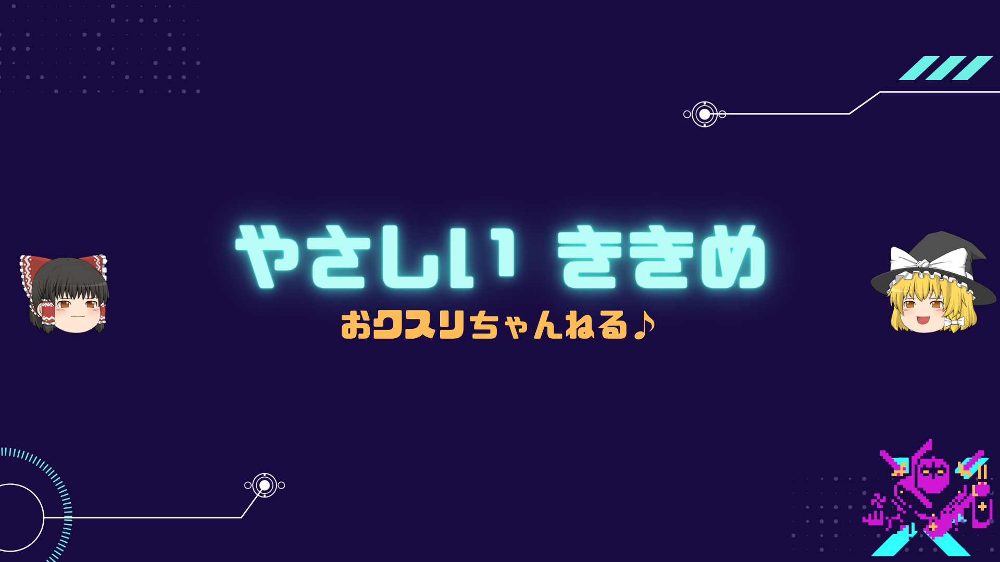

<!-- github載せたい -->

## <!--fit--> Toru Sagami（さがみとおる）
<!-- 生年月日・顔写真 -->
<!-- 顔写真があると印象に残りやすい -->
- https://github.com/ToruSagami/public_me

### 職務経歴

- サービス業の産業医として、メンタルヘルス対応、健康経営の施策立案や一般社員への研修の企画・実施などに携わる。
- ヘルスケアITの知識、臨床医・産業医の経験を活かし、人事労務担当者や産業医を対象とする研修会の講師として活動。
- 放射線診断専門医として、大学病院等での臨床経験を有する。国立がん研究センターの研究員として全国がん登録のデータベース研究を経験。
- [書籍「公衆衛生がみえる」](https://www.amazon.co.jp/%E5%85%AC%E8%A1%86%E8%A1%9B%E7%94%9F%E3%81%8C%E3%81%BF%E3%81%88%E3%82%8B-2022-2023-%E5%8C%BB%E7%99%82%E6%83%85%E5%A0%B1%E7%A7%91%E5%AD%A6%E7%A0%94%E7%A9%B6%E6%89%80/dp/4896328582/ref=sr_1_1?keywords=%E5%85%AC%E8%A1%86%E8%A1%9B%E7%94%9F%E3%81%8C%E3%81%BF%E3%81%88%E3%82%8B&qid=1661668428&sr=8-1)の企画に参画。公衆衛生学を専攻。

 

## 資格・専門領域

- 医師 労働衛生コンサルタント
- 放射線診断専門医 日本医師会認定産業医

### 専門領域:star:
- 公衆衛生学 産業医学 医療情報学 放射線診断学 臨床疫学
- 公衆衛生学 = public health = みんなの 健康 考える学問

### 関連する諸分野:moon:

臨床医学・精神医学・産業精神保健学・医療社会学・医療コミュニケーション学・健康教育学・臨床心理学・行動分析学・行動経済学・ポジティブ心理学・コーチング心理学・失敗学・データサイエンス　などなど

## ミッション🌟
### <!--fit-->働くすべての人が健康の知識・スキルを身につけて活躍する社会の実現

### これから「なりたい」「やりたい」
- **Good Condition Doctor**✨
  - in phycical, mental, social, digital in workspace and private.
  - in period of youth, middle, senior age.
- ❌病人を診る医師 ⭕組織・集団全体の全体の健康度・コンディションを向上
- ⭕スマホで知識が入手できる時代の動機づけ ⭕的確・適切な情報リリース
- ⭕医療業界の生産性向上・タスクシフト ⭕医療従事者のITスキル向上
  - 仕事・生活を豊かにするスキルテクノロジーを現場に展開

## できること:two_hearts:
- 医療の現場経験のある**産業医**として…
  - 100年人生の労働・活動・参加に必要なマインド・知識・考え方の伝達
  - ライフスタイル改善 + メンタル不調・介護・認知症の予防
  - 病気・不調の予防を通して生産性向上に寄与
- 出版・動画に携わる**専門職**として
  - 受講者ニーズに寄り添うセミナー・講演・講義
- IT・プログラミングに造詣がある**ノンプログラマー＆コンサルタント**として
  - 医師・産業保健職の生産性向上・業務改善・スキルアップ・DX

### 💎めざす方向性
- きっかけは面白く。内容はわかりやすく。ためになる・役立つ

## 最新エビデンス ✕ インプット＝ 組織アウトカム
- 働く人の健康を守り、組織の生産性を高める**コンサルティング**
- 働く集団の健康度を高め、行動変容につなげる**セミナー・研修**
  - 「働く私の休養学」「プチ不調の予防」「メンタルヘルス」 
- 人事労務向け・医療従事者向け（医師 看護師 保健師）**教育研修**

### :star:満足度の高い講演・セミナーをお約束:exclamation:
- 「おうちオフィスで最高に元気で働くジブンの作り方」
- 「転職？休職？会社を辞めず休まず続けるコツとワザ」
- 「人と組織の健康度を高めて業績アップするセルフケア強化講座」
- 「上司になる人が知っておきたい！部下のメンタル・フィジカル」
- 「人生100年時代！データで見る！日本の健康課題」

## 講師実績（セミナー・講習会・学生講義）

| 実施   | 一般・人事総務労務担当者向け                                                                                                                                                                                                                                                                                                                                                                                                                                                                    |
| ------ | ----------------------------------------------------------------------------------------------------------------------------------------------------------------------------------------------------------------------------------------------------------------------------------------------------------------------------------------------------------------------------------------------------------------------------------------------------------------------------------------------- |
| 2023年 | [現役医師が語る！学士会員の知っ得！ボケない話スベらない話](https://torusagami.github.io/public_me/2023/bokenai_suberanai_2023.marp.pdf)                                                                                                                                                                                                                                                                                                                                                         |
| 2023年 | [経営者が知らない人的資本経営～ヒト・職場の健康資本・健康資本投資～](https://torusagami.github.io/public_me/2023/2023_Health_asset.marp.pdf)                                                                                                                                                                                                                                                                                                                                                    |  | 2022年 | [今さら聞けない健康経営の知識と健康のエビデンス](https://github.com/ToruSagami/public_me/blob/main/2022/2022_Imasara_Kenko_Keiei.marp.pdf) |
| 2022年 | [ビズスキルプラス こころ・からだの新ルーティン](https://youtu.be/lxd_8Zo5pRo?t=1732)                                                                                                                                                                                                                                                                                                                                                                                                            |
| 2021年 | [知って得する復職支援～転ばぬ先の知恵～](https://github.com/ToruSagami/public_me/blob/main/2021/52p-%E9%85%8D%E5%B8%83%E7%94%A8-%E3%81%95%E3%82%93%E3%81%8E%E3%82%87%E3%81%86%E3%81%84%E6%A0%AA%E5%BC%8F%E4%BC%9A%E7%A4%BE%E3%82%BB%E3%83%9F%E3%83%8A%E3%83%BC%E4%BC%81%E7%94%BB2021%E7%9F%A5%E3%81%A3%E3%81%A6%E5%BE%97%E3%81%99%E3%82%8B%EF%BC%81%E5%BE%A9%E8%81%B7%E6%94%AF%E6%8F%B4%EF%BD%9E%E3%80%8E%E8%BB%A2%E3%81%B0%E3%81%AC%E5%85%88%E3%81%AE%E7%9F%A5%E6%81%B5%E3%80%8F%EF%BD%9E.pdf) |
| 2021年 | [生涯パフォーマンスを高めるコンディションづくり](https://github.com/ToruSagami/public_me/raw/main/2021/2021-06%E3%83%A9%E3%83%BC%E3%83%8B%E3%83%B3%E3%82%B0%E3%82%B8%E3%83%A3%E3%83%BC%E3%83%8B%E3%83%BC%E7%95%AA%E5%A4%96%E7%B7%A8.pptx)                                                                                                                                                                                                                                                       |
---
| 実施   | 医師・産業医向け（日本医師会産業医認定講習会）                                                                                                             |
| ------ | ---------------------------------------------------------------------------------------------------------------------------------------------------------- |
| 2023年 | [産業医の学び直し ～ヒト・職場の健康資本・健康資本投資とリスキリング～](https://torusagami.github.io/public_me/2023/sangyoui_manabinaosi_2023.marp.pdf) |
| 2023年 | [産業医が知っておきたい難病の知識](https://torusagami.github.io/public_me/2023/print-part1_sangyoui_nanbyo_2023.marp.pdf)                                  |  |
| 2022年 | [産業医が知っておきたい健康経営の知識](https://github.com/ToruSagami/public_me/blob/main/2022/sangyoui_kenko_keiei_2022.marp.pdf)                          |
| 2022年 | [今すぐ役立つ！産業医のデジタルトランスフォーメーション](https://github.com/ToruSagami/public_me/blob/main/2022/Sangyoui_DX_2022.marp.pdf)                 |
| 2021年 | [産業医が知っておきたい難病の知識](https://github.com/ToruSagami/public_me/blob/main/2022/part1-print-2022-2-25kenshu.pdf)                                 |  |

<!-- _class: small -->

## 学生向け（公衆衛生学講義） 
| 回  | テーマ                                                                                                                                                                                                                                  |
| --- | --------------------------------------------------------------------------------------------------------------------------------------------------------------------------------------------------------------------------------------- |
| 1   | [地域保健と保健統計](https://github.com/ToruSagami/public_me/blob/main/kango/1-%E5%9C%B0%E5%9F%9F%E4%BF%9D%E5%81%A5%E3%81%A8%E4%BF%9D%E5%81%A5%E7%B5%B1%E8%A8%88.pdf)                                                                   |
| 2   | [母子保健と学校保健](https://github.com/ToruSagami/public_me/blob/main/kango/2-%E6%AF%8D%E5%AD%90%E4%BF%9D%E5%81%A5%E3%81%A8%E5%AD%A6%E6%A0%A1%E4%BF%9D%E5%81%A5.pdf)                                                                   |
| 3   | [難病対策と感染症対策](https://github.com/ToruSagami/public_me/blob/main/kango/3-%E9%9B%A3%E7%97%85%E5%AF%BE%E7%AD%96%E3%81%A8%E6%84%9F%E6%9F%93%E7%97%87%E5%AF%BE%E7%AD%96.pdf)                                                        |
| 4   | [働く人の健康とメンタルヘルス](https://github.com/ToruSagami/public_me/blob/main/kango/4-%E5%83%8D%E3%81%8F%E4%BA%BA%E3%81%AE%E5%81%A5%E5%BA%B7%E3%81%A8%E3%83%A1%E3%83%B3%E3%82%BF%E3%83%AB%E3%83%98%E3%83%AB%E3%82%B9.pdf)            |
| 5   | [生活習慣病と介護・認知症の予防](https://github.com/ToruSagami/public_me/blob/main/kango/5-%E7%94%9F%E6%B4%BB%E7%BF%92%E6%85%A3%E7%97%85%E3%81%A8%E4%BB%8B%E8%AD%B7%E3%83%BB%E8%AA%8D%E7%9F%A5%E7%97%87%E3%81%AE%E4%BA%88%E9%98%B2.pdf) |
| 6   | [健康教育・ヘルスプロモーション](https://github.com/ToruSagami/public_me/blob/main/kango/6-%E5%81%A5%E5%BA%B7%E6%95%99%E8%82%B2%E3%83%BB%E3%83%98%E3%83%AB%E3%82%B9%E3%83%97%E3%83%AD%E3%83%A2%E3%83%BC%E3%82%B7%E3%83%A7%E3%83%B3.pdf) |
| 7   | [社会と健康](https://github.com/ToruSagami/public_me/blob/main/kango/7-%E7%A4%BE%E4%BC%9A%E3%81%A8%E5%81%A5%E5%BA%B7.pdf)                                                                                                               |

## YouTube :arrow_forward: はじめました 

- [おクスリちゃんねる💊医者も知らない新常識🍒](https://www.youtube.com/channel/UCuNBtJRNmjwoAMxWjSEl4Yg)

## [おクスリちゃんねる🍒](https://www.youtube.com/channel/UCuNBtJRNmjwoAMxWjSEl4Yg)コンテンツ例：あなたはクスリ🎵笑える？ 
<!-- _backgroundColor: lightyellow -->
- [【謎解き】え！あの人が？痛風事件💦の真犯人？【おクスリちゃんねる💊】](https://www.youtube.com/watch?v=60lzdg05T_8)
- [【新常識】歯ブラシみがき残し実は40％？最新歯みがき事情【永久歯よ！永遠なれ】](https://www.youtube.com/watch?v=jQOUiim28_Q)
- [【新常識】ピロリ菌はノーベル賞。〇〇の原因！除菌どうする？](https://www.youtube.com/watch?v=9pascTgNtfo)
- [【自分新時代】はじめてのメンタル科😍失敗しない選び方🔔【医者を見抜く】](https://www.youtube.com/watch?v=DasE1fcYZQw)
- [まだ🌷バリウム検査？最新！胃がん検診事情【おクスリ💊チャンネル】](https://www.youtube.com/watch?v=V2rkrDu6Guw)
- [【大人の歯は何本？】🦷歯を失うと〇〇症に！最新！歯周病事情🍎【ゆっくり】](https://www.youtube.com/watch?v=_A4eueSOtb0)
- [【新常識】冬に増えるインフル。夏に増える病気は？【食中毒だけ？】](https://www.youtube.com/watch?v=Jpwliy9_OpE)
- [【新常識】心療内科？精神科？違いのわかる大人の！【平安時代のメンタル？】](https://www.youtube.com/watch?v=aDuNJSyCXJc)
- [【新常識】血圧測定・いつ・どこで【デフォルト変更】](https://www.youtube.com/watch?v=jwT_c_l4g1c)
- [【睡眠の質】九州そらナビゲート！マインドフルな旅【寝る前】](https://www.youtube.com/watch?v=F_rLocr8-hA)
- [【リアル食事ゲー】ちゃっかり！おやつでビンゴ！【ダイエット女子妊活プレママ】](https://www.youtube.com/watch?v=WeD3rD7D6xU)
- [【自分新時代】俺の減塩【セブン・塩分・いい気分】](https://www.youtube.com/watch?v=6KUYCLiGnGk)
- [【令和新常識】どんな人が長生き？【ノーベル賞ギネスレジェンドの秘訣】](https://www.youtube.com/watch?v=VqfZJCA5YTg)

<!-- _class: small -->

## 趣味・特技 🌟
- パンダ🐼 カレー 地図旅行🌎 書類整理

### ストレングスファインダー強み上位５つ 
- 学習欲 分析思考 達成欲  着想 収集心

### 使用可能ツールと保有スキル

- R/RStudio データ分析 スクレイピング RPA
- markdown/marp 文書・スライド作成
- ゆっくりムービーメーカー 動画作成
- Visual Studio Code テキストエディタ

<!-- _backgroundColor: "#ffe0e0" -->
## 「機械が話す紙芝居」＝人工音声＋スライド＝動画🏆コストゼロ
<!-- _backgroundColor: "#ffe0e0" -->
| 動画コンテンツ 例                                                                     | 内容🎶                                                            |
| ------------------------------------------------------------------------------------- | ---------------------------------------------------------------- |
| [【オレの時短・DX】動画作成を自動化する](https://www.youtube.com/watch?v=2GOmlVI06Ps) | 読み上げなら機械でよくない？ タスクシフト、働き方改革、時短。 |
| [ビズスキル こころ・からだの新ルーティン](https://youtu.be/lxd_8Zo5pRo?t=1732)        | 自分でデキる！ストレスケア  毎日ストレス決算主義              |

### 学会発表・教育講演のスライド作成（録画・録音）に利用可能😁
- タスクシフト「高スキルの専門職・研究者にしかできないことに集中せよ」
  - 読み上げ・録音。それって医師・教授の仕事？そのアナログまだ続ける？

## どうして産業医？

-   医療機関で患者ひとりひとりを見ていてもキリがない
- 労働力人口の減少と高齢化という現実
  - 20-60歳代が健康を維持しながら「活躍」することが必要
- 医師は病気の専門家。健康の専門家である保証なし…
  - 大学院：**公衆(public)衛生(health) = みんなの健康** :grapes:

<!-- _color: black -->
